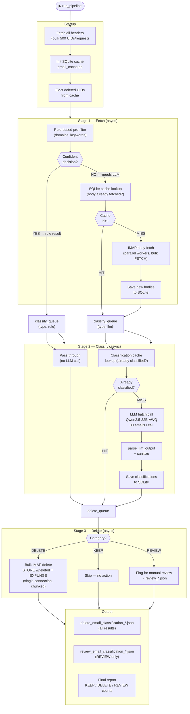

# Email Cleanup Agent

A pipeline that reads, classifies, and deletes junk email at scale using an LLM — built to deal with an inbox that grew to **26,000+ emails** over the years.

---

## The Problem

Most email clients let you delete one email at a time, or filter by sender. That works fine for keeping up with new mail, but it doesn't solve the debt of years of accumulated newsletters, promotional offers, shipping notifications, password resets, and social media pings that never got cleaned up.

With 26,000 emails, manual deletion is not realistic:
- Selecting and deleting in bulk risks losing emails you actually care about
- Simple filters by domain miss the long tail of one-off senders
- You can't just delete everything — there are real invoices, receipts, job interviews, and personal messages mixed in

What you need is something that can **read every email, understand what it is, and make a smart decision** about whether to keep or delete it.

---

## How It Works

The pipeline runs in three concurrent async stages connected by bounded queues. The diagram below shows the full data flow from IMAP server to deletion.



### Key design decisions

| Decision | Why |
|----------|-----|
| **3 concurrent async stages** | Fetch, classify and delete run simultaneously via `asyncio.gather` — the pipeline never idles waiting for one stage to finish |
| **Bounded queues** (`FETCH_QUEUE_MAX=5`, `DELETE_QUEUE_MAX=20`) | Backpressure — prevents a fast fetch stage from flooding memory if the LLM is slower |
| **Rule-based pre-filter first** | Obvious spam/newsletters never hit the LLM, cutting token cost by 30–40% |
| **Two-layer cache** (bodies + classifications) | Crash-safe: resume from any point without re-fetching or re-classifying |
| **Bulk IMAP fetch** (500 UIDs/request) | Reduces IMAP round-trips from N to ceil(N/500) |
| **Single delete session** | All deletions happen in one IMAP connection at the end — avoids repeated SSL handshakes and server rate limits |

### Why the SQLite Cache?

Reading 26,000 emails over IMAP is slow. Each email body requires a separate round-trip to the server, and IMAP servers rate-limit aggressive clients. On a first run, fetching all bodies can take **30–60 minutes**.

The SQLite cache (`email_cache.db`) solves this:

- Email bodies, headers, and classifications are stored locally after the first fetch
- On every subsequent run, already-fetched emails are served from disk instantly
- If the pipeline crashes halfway through, it resumes from where it left off without re-fetching
- Classifications are also cached — emails classified in a previous run are never sent to the LLM again

Without the cache, every run would cost both time and money. With it, only new or unclassified emails hit the LLM.

---

## Time & Cost Estimates

### Setup

- **Email count:** 26,000
- **Batch size:** 30 emails per LLM call → ~867 LLM calls
- **Rule-based pre-filter:** catches ~30–40% of obvious junk before LLM → ~520–600 actual LLM calls
- **Average tokens per batch:** ~2,000 input + ~300 output ≈ 2,300 tokens/call
- **Total tokens (estimate):** ~560 calls × 2,300 ≈ **~1.3M tokens**

---

### Self-Hosted: Qwen/Qwen2.5-32B-Instruct-AWQ on RunPod A40

| Item | Value |
|------|-------|
| GPU | NVIDIA A40 (48 GB VRAM) |
| Model | Qwen2.5-32B-Instruct-AWQ (4-bit quantized) |
| Cost | **$0.47/hr** |
| Throughput (estimate) | ~800–1,200 tokens/sec on A40 with AWQ |
| Total tokens to process | ~1.3M tokens |
| Estimated time | **~18–27 minutes of active inference** |
| Billed time (with startup, IMAP fetch) | ~1.0–1.5 hours total |
| **Estimated total cost** | **~$0.47 – $0.70** |

The AWQ quantization cuts memory use roughly in half versus FP16, allowing the 32B model to fit on a single A40 with headroom for long context batches.

---

### Cost Comparison: Same Workload on Hosted APIs

Assuming ~1.3M input tokens + ~200K output tokens:

| Provider | Model | Input price | Output price | Estimated cost |
|----------|-------|------------|--------------|----------------|
| **Self-hosted** | Qwen2.5-32B-AWQ (A40) | $0.47/hr (compute) | — | **~$0.50–0.70** |
| Anthropic | claude-haiku-4-5 | $0.80 / 1M tokens | $4.00 / 1M tokens | ~$1.84 |
| Anthropic | claude-sonnet-4-5 | $3.00 / 1M tokens | $15.00 / 1M tokens | ~$6.90 |
| Anthropic | claude-opus-4 | $15.00 / 1M tokens | $75.00 / 1M tokens | ~$34.50 |
| OpenAI | gpt-4o-mini | $0.15 / 1M tokens | $0.60 / 1M tokens | ~$0.32 |
| OpenAI | gpt-4o | $2.50 / 1M tokens | $10.00 / 1M tokens | ~$5.25 |
| OpenAI | o3-mini | $1.10 / 1M tokens | $4.40 / 1M tokens | ~$2.31 |

> Prices are approximate based on publicly listed rates as of May 2026. Actual costs vary by exact token counts and any volume discounts.

**Key insight:** Self-hosting Qwen2.5-32B-AWQ on a spot A40 is cost-competitive with `gpt-4o-mini` and 5–70× cheaper than frontier models, while being a capable enough model for email classification — a task that doesn't require state-of-the-art reasoning.

---

## Technical Challenges

### 1. IMAP Rate Limits
IMAP servers (especially Gmail) throttle clients that open too many connections or issue too many fetch commands. The pipeline uses a bounded thread pool (`IMAP_WORKERS=5`) and exponential backoff on retries to stay within limits.

### 2. Corrupt & Malformed Headers
Real-world email headers are a mess: MIME-encoded words with wrong charsets, lone UTF-16 surrogate characters, bytes labelled as UTF-8 that aren't. The `decode_mime` function handles this with a fallback path that decodes each chunk independently with `errors="replace"`.

### 3. LLM Output Reliability
The LLM occasionally returns malformed JSON, skips emails, or returns `subject` as an array instead of a string. The `parse_llm_output` + `sanitize` pipeline handles this: regex extraction as fallback, type coercion, and filtering out hallucinated placeholder IDs.

### 4. Backpressure
Fetching bodies is slower than the LLM can consume them, and deletion is slower than classification. Async queues with bounded sizes (`FETCH_QUEUE_MAX`, `DELETE_QUEUE_MAX`) prevent memory from growing unbounded when one stage is faster than another.

---

## Usage

```bash
cp .env.example .env
# fill in IMAP_SERVER, EMAIL, PASSWORD, OPENAI_API_KEY (or compatible endpoint)

python main.py
```

Set `DRY_RUN = True` in `main.py` to classify without deleting anything.
